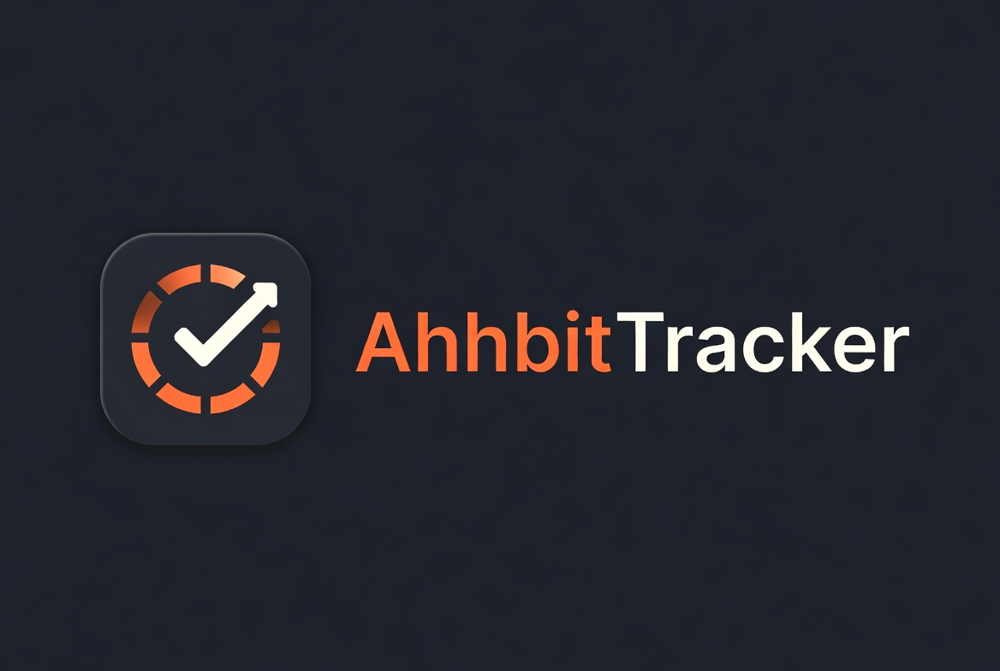

# AhhbitTracker

<p align="center">
  
</p>

<p align="center">
  <strong>On-chain habit tracking with accountability on Stacks</strong>
</p>

<p align="center">
  <a href="https://github.com/Yusufolosun/AhhbitTracker/actions/workflows/ci.yml"></a>
  <a href="https://github.com/Yusufolosun/AhhbitTracker/actions/workflows/security-scan.yml"></a>
  <a href="https://www.npmjs.com/package/@yusufolosun/stx-utils"></a>
  <a href="https://explorer.hiro.so/address/SP1N3809W9CBWWX04KN3TCQHP8A9GN520BD4JMP8Z.habit-tracker-v2?chain=mainnet"></a>
  <a href="LICENSE"></a>
  <a href="https://react.dev/"></a>
  <a href="https://docs.stacks.co/clarity"></a>
</p>

---

## Table of Contents

- [What is AhhbitTracker?](#what-is-ahhbittracker)
- [How It Works](#how-it-works)
- [Tech Stack](#tech-stack)
- [Getting Started](#getting-started)
  - [Testing](#testing)
  - [External Packages](#external-packages)
  - [Production Build](#production-build)
- [Deploy to Vercel](#deploy-to-vercel)
- [Contract Reference](#contract-reference)
- [Security](#security)
- [Documentation](#documentation)
- [Contributing](#contributing)
- [License](#license)

---

## What is AhhbitTracker?

AhhbitTracker is a decentralized habit-tracking dApp on the [Stacks](https://www.stacks.co/) blockchain. Stake STX as a financial commitment to daily habits. Miss a day — your stake is forfeited to a shared pool. Complete a 7-day streak — reclaim your stake and earn bonuses from forfeited stakes.

**Live contract:** [`SP1N3809W9CBWWX04KN3TCQHP8A9GN520BD4JMP8Z.habit-tracker-v2`](https://explorer.hiro.so/address/SP1N3809W9CBWWX04KN3TCQHP8A9GN520BD4JMP8Z.habit-tracker-v2?chain=mainnet)

## How It Works

1. **Stake** — Create a habit and deposit ≥ 0.02 STX as your commitment
2. **Check In** — Record daily completion within the 24-hour window (~144 blocks)
3. **Streak** — Maintain a 7-day streak to unlock withdrawal
4. **Withdraw** — Reclaim your stake and claim your share of the bonus pool

Missed check-ins forfeit your stake to the shared pool, distributed as rewards to users who complete their streaks.

## Tech Stack

| Layer | Technology |
|---|---|
| Smart Contract | Clarity 2.0 on Stacks Mainnet |
| Frontend | React 18 · TypeScript · Vite 5 · Tailwind CSS |
| State | @tanstack/react-query |
| Blockchain Read Sync | Layered read-through caching + transaction-aware invalidation |
| Wallet | @stacks/connect (Leather · Xverse · Asigna) |
| Testing | Vitest + Clarinet SDK |
| Deployment | Vercel |

## Getting Started

**Prerequisites:** Node.js ≥ 18, [Clarinet CLI](https://docs.hiro.so/clarinet/getting-started)

```bash
git clone https://github.com/Yusufolosun/AhhbitTracker.git
cd AhhbitTracker
npm install

cd frontend
cp .env.example .env.local
npm install
npm run dev                  # → http://localhost:3000
```

### Testing

```bash
npm test              # Run contract and integration tests
cd frontend && npm test   # Run frontend tests (30 tests)
clarinet check        # Validate Clarity syntax
```

### Environment Stages

The repository now supports three explicit runtime stages without committing secrets:

- `development`
- `staging`
- `production`

Use stage templates as your starting point and keep real values in local-only files:

```bash
# Root scripts (deployment and automation)
cp .env.development.example .env.development.local
cp .env.staging.example .env.staging.local
cp .env.production.example .env.production.local

# Frontend (Vite)
cp frontend/.env.development.example frontend/.env.development.local
cp frontend/.env.staging.example frontend/.env.staging.local
cp frontend/.env.production.example frontend/.env.production.local

# Mobile (Expo)
cp mobile/.env.development.example mobile/.env.development.local
cp mobile/.env.staging.example mobile/.env.staging.local
cp mobile/.env.production.example mobile/.env.production.local
```

`*.local` env files are gitignored. Commit only `*.example` templates and never commit mnemonics, private keys, or secret API credentials.

### External Packages

| Package | Description |
|---|---|
| [`stx-utils`](https://github.com/Yusufolosun/ahhbit-tracker-stx-utils) | Zero-dependency utility library for Stacks — formatting, validation, block math, address helpers |
| [`ahhbit-tracker-sdk`](https://github.com/Yusufolosun/ahhbit-tracker-sdk) | Typed SDK for the AhhbitTracker contract — transaction builders, read-only queries, post-conditions |
| [`defikit`](https://github.com/Yusufolosun/ahhbit-tracker-defikit) | DeFi utility toolkit for basis points, fee math, slippage, AMM and token amount helpers |

### Production Build

```bash
cd frontend
npm run build         # → frontend/dist/
npm run preview       # Preview locally
```

## Deploy to Vercel

1. Import the repository in [Vercel](https://vercel.com)
2. Set **Root Directory** → `frontend`
3. Build settings are auto-detected from `vercel.json`
4. Optionally override `VITE_CONTRACT_ADDRESS` / `VITE_CONTRACT_NAME`

## Contract Reference

| Function | Description |
|---|---|
| `create-habit` | Create a habit with STX stake |
| `check-in` | Record daily check-in |
| `withdraw-stake` | Reclaim stake after 7-day streak |
| `claim-bonus` | Claim share of forfeited pool |
| `get-habit` | Read habit details |
| `get-pool-balance` | View total forfeited STX |
| `get-unclaimed-completed-habits` | View pending bonus claimant count |
| `get-estimated-bonus-share` | View next estimated bonus share |

Full reference → [docs/API_REFERENCE.md](docs/API_REFERENCE.md)

## Security

- Post-condition validation on every STX transfer
- On-chain authorization — only habit owners can check in, withdraw, or claim
- Input validation enforced in the smart contract
- No private keys, mnemonics, or secrets in this repository

See [docs/SECURITY.md](docs/SECURITY.md) for the full security model.

## Documentation

| Document | Description |
|---|---|
| [User Guide](docs/USER_GUIDE.md) | End-user walkthrough |
| [API Reference](docs/API_REFERENCE.md) | Contract functions and error codes |
| [Architecture](docs/ARCHITECTURE.md) | System design and data flow |
| [FAQ](docs/FAQ.md) | Common questions |
| [Security](docs/SECURITY.md) | Security model |

## Contributing

Pull requests are welcome. See [CONTRIBUTING.md](CONTRIBUTING.md).

## License

[MIT](LICENSE)
